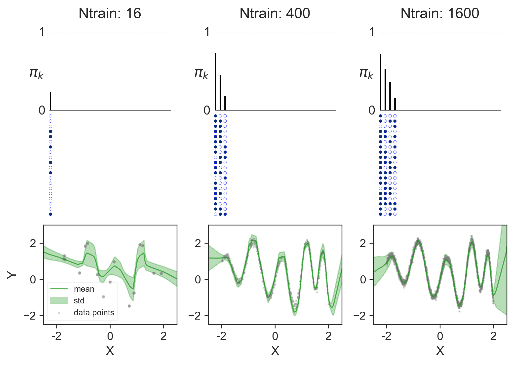

Joint Inference for Neural Network Depth and Dropout Regularization 
============================================


Dropout regularization methods prune a neural network's pre-determined backbone structure to avoid overfitting. However, a deep model still tends to be poorly calibrated with high confidence on incorrect predictions. We propose a unified Bayesian model selection method to jointly infer the most plausible network depth warranted by data, and perform dropout regularization simultaneously. In particular, to infer network depth we define a beta process over the number of hidden layers which allows it to go to infinity. Layer-wise activation probabilities induced by the beta process modulate neuron activation via binary vectors of a conjugate Bernoulli process. Experiments across domains show that by adapting network depth and dropout regularization to data, our method achieves superior performance comparing to state-of-the-art methods with well-calibrated uncertainty estimates. In continual learning, our method enables neural networks to dynamically expand their depths and neuron activations to accommodate incrementally available data beyond their initial structures, and alleviate catastrophic forgetting.

The basic codebase is implemented in Python 3.7.6 and is provided in experiments folder. The package version used for development are as follows:
```
1. torch 	        1.5.0
2. torchvision 	        0.4.2
3. numpy 	        1.18.1
4. pandas 	        1.0.1
5. matplotlib 	        3.1.3
6. seaborn 	        0.10.0
7. tqdm 	        4.42.1
8. argparse 	        1.1
9. texttable 	        1.6.2
```

Install all requirements and `Depth_and_Dropout` package using following commands
```bash
pip install -r requirements.txt
pip install -e .
```

Change to the `experiments` directory:
```bash
cd experiments
```

### Synthetic experiments

Train the model on sythetic experiments:
```bash
python synthetic_experiments.py
```

### Image experiments
Train the model for image classification on MNIST dataset:
```bash
python image_experiments.py
```

## Citation

If you find this code useful, please consider citing our paper:

> Kishan K C, Rui Li, Mahdi Gilany. (2021). Joint Inference for Neural Network Depth and Dropout Regularization. Proceedings of the Advances in Neural Information Processing Systems. 

```bibtex
@inproceedings{kc2021DepthandDropout,
 title={Joint Inference for Neural Network Depth and Dropout Regularization},
 author={K C, Kishan and Li, Rui and Gilany, Mahdi}
 booktitle = {Advances in Neural Information Processing Systems},
 year = {2021}
}
```